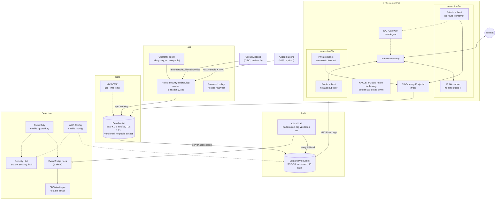

# secure-aws-terraform

A small but complete AWS baseline written in Terraform: a VPC with public and private subnets, least privilege IAM roles, encrypted S3 storage, CloudTrail audit logs and threat detection. Every pull request is scanned with Checkov, and a single failing check breaks the build.

The whole thing is built to cost nothing. There is no AWS account behind it and nothing is ever applied. The code is checked with `terraform validate` and Checkov in GitHub Actions, which are both free. Anything AWS would bill for sits behind an `enable_*` flag that defaults to `false`.

## Contents

- [Architecture](#architecture)
- [Risks and the controls that cover them](#risks-and-the-controls-that-cover-them)
- [Paid features](#paid-features)
- [Checkov checks that are skipped on purpose](#checkov-checks-that-are-skipped-on-purpose)
- [Layout](#layout)
- [Modules](#modules)
- [CI](#ci)
- [Running it locally](#running-it-locally)

## Architecture

One account, one region (`eu-central-1`). Solid lines are free and always on. Dashed lines are paid and only exist when their flag is turned on.



## Risks and the controls that cover them

Each row pairs a risk with the control that handles it, where that control lives in the code, and the Checkov checks that enforce it in CI. If any of those checks fails, the build fails. "n/a" means there is no Checkov check for it and the control comes from the design itself.

### Network

| Risk | Control | Terraform | Checkov | Cost |
|---|---|---|---|---|
| Private resources reachable from the internet | Private subnets have no internet route and public subnets don't hand out public IPs | `network`: `aws_route_table.private`, `aws_subnet.public/private` | CKV_AWS_130 | Free |
| Someone uses the default security group and it lets everything in | The default SG has every rule removed | `network`: `aws_default_security_group.this` | CKV2_AWS_12 | Free |
| SSH, RDP or FTP exposed to the internet | NACLs only allow 443 and return traffic from outside, and 3389 is carved out of the return range too | `network`: `aws_network_acl.public/private` | CKV_AWS_229, CKV_AWS_230, CKV_AWS_231, CKV_AWS_232 | Free |
| Opening a NAT just so private subnets can reach S3 | S3 Gateway Endpoint, traffic never leaves the AWS network | `network`: `aws_vpc_endpoint.s3` | n/a | Free (NAT is paid, off) |
| No way to look back at suspicious traffic | VPC Flow Logs capture all traffic into the log archive | `network`: `aws_flow_log.this` | CKV2_AWS_11 | Free |

### Identity and access

| Risk | Control | Terraform | Checkov | Cost |
|---|---|---|---|---|
| Overly broad permissions (`*:*`, admin policies) | Four task based roles, each with only what it needs | `iam`: `aws_iam_role.*`, `aws_iam_role_policy.*` | CKV_AWS_1, CKV_AWS_62, CKV_AWS_63, CKV_AWS_49, CKV_AWS_274, CKV2_AWS_40 | Free |
| Privilege escalation, credential exposure, data exfiltration through IAM | Policies are scoped by action and resource, and the guardrail policy denies escalation paths | `iam`: `aws_iam_policy.guardrails` | CKV_AWS_107, CKV_AWS_108, CKV_AWS_109, CKV_AWS_110, CKV_AWS_111, CKV_AWS_356 | Free |
| A role later gets too much access and someone switches off security tooling | A deny only guardrail on every role: CloudTrail, GuardDuty, Config, Access Analyzer and Flow Logs can't be turned off and the log archive can't be deleted | `iam`: `aws_iam_policy.guardrails`, `aws_iam_role_policy_attachment.guardrails` | n/a | Free |
| Anyone or any service can assume a role | Trust policies are pinned to a service, this account or an OIDC subject, and human roles need MFA | `iam`: `aws_iam_role.*` trust policies | CKV_AWS_60, CKV_AWS_61 | Free |
| Long lived AWS keys leaking from CI | GitHub OIDC with short lived tokens, only for `main` in this repo | `iam`: `aws_iam_openid_connect_provider.github`, `aws_iam_role.ci_readonly` | CKV_AWS_358, CKV_AWS_393, CKV_AWS_41 | Free |
| The CI role reading sensitive data through its read access | `ReadOnlyAccess` plus an explicit deny on S3 objects, secrets, SSM parameters and KMS decrypt | `iam`: `aws_iam_role_policy.ci_deny_data` | n/a | Free |
| Weak or reused passwords | 14+ characters, complexity, 90 day rotation, last 24 passwords blocked | `iam`: `aws_iam_account_password_policy.this` | CKV_AWS_9 to CKV_AWS_15 | Free |
| Resources quietly shared outside the account | IAM Access Analyzer reports external access | `iam`: `aws_accessanalyzer_analyzer.this` | n/a | Free |

### Data

| Risk | Control | Terraform | Checkov | Cost |
|---|---|---|---|---|
| A public S3 bucket | All four public access block settings on, ACLs disabled | `storage`/`logging`: `aws_s3_bucket_public_access_block.*`, `aws_s3_bucket_ownership_controls.*` | CKV2_AWS_6, CKV_AWS_53, CKV_AWS_54, CKV_AWS_55, CKV_AWS_56, CKV2_AWS_65, CKV_AWS_20, CKV_AWS_57 | Free |
| Unencrypted data at rest | Data bucket uses SSE-KMS with `aws/s3`, log archive uses SSE-S3, non KMS uploads are rejected | `storage`/`logging`: `aws_s3_bucket_server_side_encryption_configuration.*`, `aws_s3_bucket_policy.data` | CKV_AWS_19 | Free (CMK is paid, off) |
| Data sent over plain HTTP or old TLS | Bucket policies deny HTTP and anything older than TLS 1.2 | `storage`/`logging`: `aws_s3_bucket_policy.*` | n/a | Free |
| Objects deleted or overwritten by mistake | Versioning, old versions kept for 30 days | `storage`/`logging`: `aws_s3_bucket_versioning.*`, `aws_s3_bucket_lifecycle_configuration.*` | CKV_AWS_21, CKV2_AWS_61, CKV_AWS_300 | Free |
| Something other than the app touching the data | Only the `app` role can read or write objects, and it can't change bucket settings | `iam`: `aws_iam_role_policy.app` | CKV_AWS_283, CKV_AWS_93 | Free |
| No record of who read which object | Server access logs go to the log archive | `storage`: `aws_s3_bucket_logging.data` | CKV_AWS_18 | Free |
| A customer managed key that is never rotated | Yearly automatic rotation when `use_kms_cmk = true` | `storage`: `aws_kms_key.data` | CKV_AWS_7, CKV_AWS_227, CKV_AWS_33, CKV2_AWS_64 | Paid, off |

### Audit and detection

| Risk | Control | Terraform | Checkov | Cost |
|---|---|---|---|---|
| Not knowing who did what in the account | Multi region CloudTrail with global services and all management events | `logging`: `aws_cloudtrail.this` | CKV_AWS_67, CKV_AWS_251 | Free |
| Logs edited or deleted after the fact | Log file validation (signed digest files), a versioned archive, and the guardrail blocks deletes | `logging`: `aws_cloudtrail.this`, `aws_s3_bucket_versioning.log_archive` | CKV_AWS_36 | Free |
| Another account or trail writing into the log archive | The bucket policy only allows this account's trail and log services | `logging`: `aws_s3_bucket_policy.log_archive` | CKV_AWS_283 | Free |
| Root use, logins without MFA, or IAM/SG/S3 changes going unnoticed | Six EventBridge rules that send alerts to SNS | `detection`: `aws_cloudwatch_event_rule.alerts`, `aws_sns_topic.alerts` | n/a | Free |
| Insecure config being deployed at all | Checkov scans every PR and one failure breaks the build | `.github/workflows/terraform-ci.yml`, `.checkov.yaml` | All of them | Free |
| The CI pipeline itself becoming an attack path | Workflows are scanned too and `permissions` are set per job | `.github/workflows/terraform-ci.yml` | CKV_GHA_1 to CKV_GHA_7, CKV2_GHA_1 | Free |
| The Checkov gate silently doing nothing | A self-test that makes sure a deliberately insecure example fails | `tests/checkov/insecure` | n/a | Free |
| Stolen credentials, crypto mining, traffic to known bad IPs | GuardDuty, with severity 7+ findings sent to SNS | `detection`: `aws_guardduty_detector.this` | CKV_AWS_238 | Trial, off |
| Insecure changes made by hand in the console after deploy | AWS Config with 13 managed rules | `detection`: `aws_config_configuration_recorder.this`, `aws_config_config_rule.managed` | CKV2_AWS_45, CKV2_AWS_48 | Paid, off |
| Findings scattered across services | Security Hub with AWS Foundational Security Best Practices | `detection`: `aws_securityhub_account.this` | n/a | Trial, off |

## Paid features

All of these live in `envs/dev/variables.tf` and default to `false`. Set them in a `terraform.tfvars` file to turn them on. When a flag is off the resources behind it are never created.

| Variable | What it adds | Why it's off | Rough cost |
|---|---|---|---|
| `enable_nat` | One NAT gateway and Elastic IP so private subnets can reach the internet | Billed hourly plus data, and S3 already goes through the endpoint | ~0.05 USD/hour + data |
| `use_kms_cmk` | A customer managed, rotated KMS key for the data bucket | The `aws/s3` key is free and encrypts just as well | ~1 USD/month |
| `enable_s3_data_events` | CloudTrail object write and delete events for the data bucket | Billed per event | ~0.10 USD per 100k events |
| `enable_guardduty` | GuardDuty plus an alert for high severity findings | Paid after 30 days | 30 day trial, then by volume |
| `enable_config` | AWS Config recorder and 13 rules | Billed per recorded item and rule evaluation | Usage based |
| `enable_security_hub` | Security Hub with the FSBP standard | Paid after 30 days | 30 day trial, then per check |

`enable_security_alerts` is `true` by default and turns on the free EventBridge and SNS alerts. Set `alert_email` if you want them by email.

Prices are rough numbers from AWS's public pricing. Check the Free Tier page of your own account before deploying anything.

## Checkov checks that are skipped on purpose

When Checkov flagged something, the first move was to fix the design. Skipping was the last resort. Every skip sits next to its resource as a `#checkov:skip` line with a reason, and skipped results are stripped from the SARIF before it's uploaded to the GitHub Security tab.

| Check | Where | Why |
|---|---|---|
| CKV_AWS_18 (access logging) | Log archive bucket | This bucket is the access log target, logging it into itself would loop |
| CKV_AWS_144 (cross region replication) | Log archive bucket | Single region project |
| CKV_AWS_145 (KMS encryption) | Log archive bucket | A customer managed key costs money, so it uses SSE-S3 |
| CKV2_AWS_62 (event notifications) | Log archive bucket | Not needed for a log archive |
| CKV2_AWS_1 (NACL attached to subnets) | NACLs | They are attached, Checkov just can't resolve subnets created with `count` |
| CKV_AWS_144 (cross region replication) | Data bucket | Single region project |
| CKV_AWS_109, CKV_AWS_111, CKV_AWS_356 | KMS key policy | A key policy always uses `"*"` as the resource and it only means that key |
| CKV_AWS_35 (CloudTrail encrypted with a CMK) | CloudTrail | A customer managed key costs money, logs are already SSE-S3 encrypted in the archive |
| CKV2_AWS_10 (CloudWatch Logs) | CloudTrail | Ingestion is billed, the logs stay in S3 |
| CKV_AWS_252 (SNS delivery notifications) | CloudTrail | Nothing would subscribe to them |
| CKV_AWS_26 (SNS encrypted with KMS) | Alert topic | EventBridge can't publish to a topic encrypted with `aws/sns` and a customer managed key costs money. Messages only carry event summaries |
| CKV2_AWS_3 (GuardDuty at org level) | GuardDuty | Single account, no AWS Organizations |

## Layout

```
envs/dev/            The only environment (eu-central-1), wires the modules together
modules/network/     VPC, subnets, NACLs, S3 endpoint, flow logs, optional NAT
modules/iam/         Roles, guardrail policy, password policy, Access Analyzer
modules/storage/     Data bucket, optional KMS CMK
modules/logging/     Log archive bucket, CloudTrail
modules/detection/   EventBridge + SNS alerts, optional GuardDuty/Config/Security Hub
tests/checkov/       Deliberately insecure example that proves the Checkov gate works
.checkov.yaml        Checkov settings (terraform + github_actions)
.github/workflows/   CI
```

## Modules

### Network

- A `10.0.0.0/16` VPC across two AZs, with one public and one private subnet in each.
- Public subnets don't assign public IPs automatically. Private subnets have no default route out.
- Private subnets reach S3 through a free **S3 Gateway Endpoint**. NAT costs money, so `enable_nat` is `false` by default.
- The default security group has all its rules removed.
- NACLs are a second layer: from the internet only HTTPS (443) and return traffic get in, and RDP (3389) is blocked even inside the return port range.
- VPC Flow Logs send all traffic to the central **log archive bucket**, which is encrypted (SSE-S3), versioned, closed to the public, HTTPS only, and deletes logs after 90 days.

### IAM

Nobody gets permissions directly as an IAM user. Work happens through roles, and each role only gets what its job needs.

| Role | Who assumes it | What it can do |
|---|---|---|
| `security-auditor` | Users in the account, **MFA required** | AWS's `SecurityAudit` policy: reads security settings, can't change anything |
| `log-reader` | Users in the account, **MFA required** | Lists and reads the log archive bucket, nothing else |
| `ci-readonly` | GitHub Actions through **OIDC**, only from `main` in this repo | `ReadOnlyAccess` for `terraform plan`, with S3 objects, secrets, SSM parameters and KMS decrypt explicitly denied |
| `app` | EC2 through an instance profile, this account only | Reads, writes and deletes objects in the data bucket, nothing more |

On top of that:
- **Guardrail policy:** a deny only policy attached to every role. Even if a role is given too much later on, it still can't escalate privileges through IAM, switch off CloudTrail, GuardDuty, Config, Access Analyzer or Flow Logs, or delete the log archive or change its policy.
- **No long lived keys:** if CI ever talks to AWS it uses short lived OIDC tokens. There is no AWS account right now, so CI doesn't use the role yet.
- **Password policy:** at least 14 characters, upper and lower case, a number, a symbol, rotation every 90 days, and the last 24 passwords can't be reused.
- **IAM Access Analyzer:** flags anything shared outside the account, for free.

### Encrypted storage

A separate S3 bucket for application data:

- **Encryption:** SSE-KMS with the AWS managed `aws/s3` key by default. The key is free and the bucket key keeps KMS requests very low. `use_kms_cmk = true` switches to a customer managed key that rotates every year (**paid**, ~1 USD/month).
- **Bucket policy:** rejects HTTP, TLS older than 1.2, and uploads that aren't KMS encrypted.
- **Access:** ACLs are off and public access is blocked. Only the `app` role can touch objects, and it can't change bucket settings.
- **Recovery:** versioning is on and old versions of overwritten or deleted objects are kept for 30 days.
- **Visibility:** server access logs go to the log archive, and object events go to EventBridge.

### Audit logging

CloudTrail records every API call in the account: who, when, from where, and what.

- **Coverage:** all regions plus global services like IAM and STS, and every management event, reads and writes. The first trail copy of management events is **free**.
- **Integrity:** log file validation is on, so CloudTrail writes a signed digest every hour and any later edit or delete shows up.
- **Storage:** logs land in the log archive bucket, which is encrypted, versioned and closed to the public. Its policy only lets this account's own trail write.
- **Can't be switched off:** the guardrail policy denies `StopLogging`, `DeleteTrail` and `UpdateTrail` for every role.
- **Optional (paid):** `enable_s3_data_events = true` also records object writes and deletes in the data bucket.

### Threat detection

There are two layers. One is free and always on, the other is paid and off by default (see [Paid features](#paid-features)).

Risky events that CloudTrail records are picked up right away by EventBridge rules and sent to SNS. If `alert_email` is set, they arrive by email.

| Alert | What it catches |
|---|---|
| `root-usage` | Any use of the root account |
| `console-login-without-mfa` | Console login without MFA |
| `iam-policy-change` | IAM policy or role changes and new access keys |
| `logging-tampering` | Attempts to stop or delete CloudTrail, GuardDuty, Config or Flow Logs |
| `security-group-open` | Security group and NACL rule changes |
| `s3-bucket-exposure` | Changes to bucket policies, ACLs, public access block or encryption |

**Checkov vs. Config:** Checkov scans the code **before** deploy and stops insecure config from ever existing, which makes it a preventive control. Config watches the live account **after** deploy and catches changes someone makes by hand in the console, which makes it a detective control. Here the preventive layer is free and always on, and the free part of the detective layer is the EventBridge alerts.

## CI

The `terraform-ci` workflow runs three jobs on every pull request and every push to `main`:

1. **fmt and validate:** `terraform fmt -check`, `terraform init -backend=false` and `terraform validate`. No AWS credentials needed.
2. **Checkov scan:** scans the Terraform code and the workflow files. One failing check breaks the build. Results are uploaded to the GitHub Security tab as SARIF.
3. **Checkov self-test:** scans the deliberately insecure code in `tests/checkov/insecure` (a public S3 bucket and SSH open to the world) and makes sure Checkov **rejects** it. If Checkov ever starts letting everything through, this job fails.

## Running it locally

```bash
terraform fmt -check -recursive
cd envs/dev && terraform init -backend=false && terraform validate && cd -
pip install checkov==3.3.19
checkov --config-file .checkov.yaml
```
